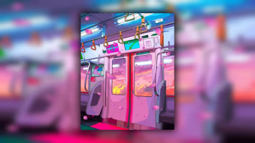

- [isoate_1080p.sh](isoate_1080p.sh): move images with are 1920x1080 pixels in resolution to their own directory
- [dropshadow.py](dropshadow.py): Make an image fit wallpaper dimensions by overlaying it with a drop shadow on a resized and heavily blurred version itself to keep a consistent visual style. Requires PIL and Xlib (Xlib just for defaults).

| input | output |
|---|---|
|  |  |
